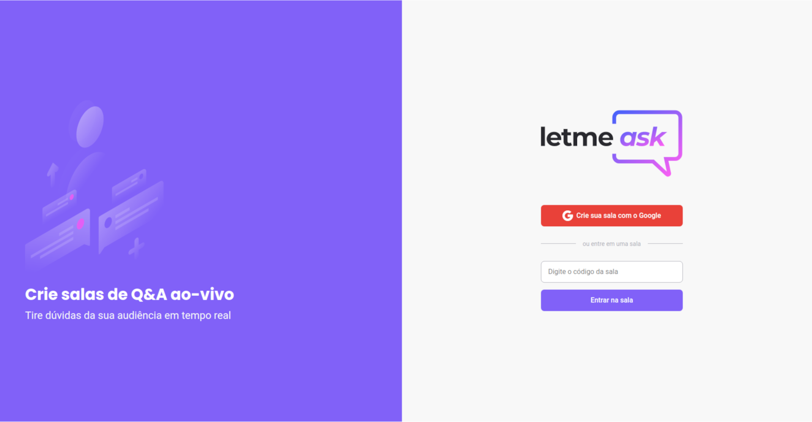

<p align="center">
  
</p>

<p align="center">
  
  
  

     
</p>

<h1 align="center">
    
</h1>

<br>

## 🧪 Tecnologias

Esse projeto foi desenvolvido durante a 6º edição da Next Level Week usando as seguintes tecnologias:

- [React](https://reactjs.org)
- [Firebase](https://firebase.google.com/)
- [TypeScript](https://www.typescriptlang.org/)

## 🚀 Como executar
Primeiro de tudo você precisa ter o `git`,`node` e `yarn` instalados na sua máquina.

Depois de instalados, clone o projeto e acesse a pasta do mesmo.
```bash
$ git clone https://github.com/Augusto-Neves/letmeask
$ cd letmeask
```
Para iniciá-lo, siga os passos abaixo:
```bash
# Instalar as dependências
$ yarn install

# Iniciar o projeto
$ yarn start
```
O app estará disponível no seu browser pelo endereço http://localhost:3000.

Lembrando que será necessário criar uma conta no [Firebase](https://firebase.google.com/) e um projeto para disponibilizar um Realtime Database.

## 💻 Projeto

Letmeask é perfeito para criadores de conteúdos poderem criar salas de Perguntas e Repostas com o seu público, de uma forma muito organizada e democrática. 

Este é um projeto foi desenvolvido durante a **[Next Level Week Together](https://nextlevelweek.com/)**, que ocorreu durante os dias dias 20 a 27 de Junho de 2021.

## 📝 License

Esse projeto está sob a licença MIT. Veja o arquivo [LICENSE](LICENSE.md) para mais detalhes.

---
## Agradecimentos

<ul>
    <li><a href="https://github.com/Rocketseat" target="_blank">Rocketseat</a></li>    
    <li><a href="https://github.com/diego3g" target="_blank">Diego Fernandes</a></li>    
</ul>

## Como entrar em contato comigo

[](https://www.linkedin.com/in/augusto-neves-066b7b1ab)
[](https://www.instagram.com/_augusto_neves/)
